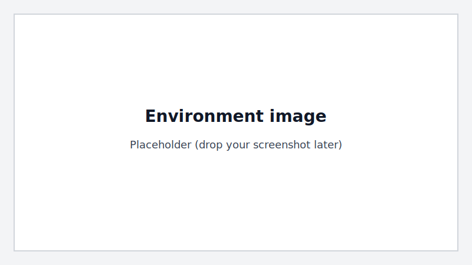

Make Coffee
===========

Task key: ``make_coffee``.

``make_coffee`` is a single-arm rigid-object task. A coffee machine and a mug
are spawned, and the agent must place the mug onto the machine tray.

Goal
----

- Place the mug in the tray region of the coffee machine.

Quickstart
----------

.. code-block:: python

   import dexsuite as ds

   env = ds.make(
       "make_coffee",
       manipulator="franka",
       gripper="robotiq",
       arm_control="osc_pose",
       gripper_control="joint_position",
       render_mode="human",
   )

   obs, info = env.reset()
   obs, reward, terminated, truncated, info = env.step(env.action_space.sample())

   env.close()

Task Entities
-------------

- ``machine``: a fixed coffee machine.
- ``mug``: a rigid mug to place.
- ``mug_target``: a marker linked to the mug (used as a handle-side reference).

Extra Observations
------------------

Make-coffee adds (under ``obs["state"]["other"]``):

- ``machine_pos`` (shape ``(n_envs, 3)``)
- ``mug_pos`` (shape ``(n_envs, 3)``)

Termination
-----------

- **Success:** mug rests in the tray region for several frames (see ``REST_FRAMES``).
- **Failure:** mug leaves the workspace AABB, or a fast drop is detected while the TCP is far.
- **Truncation:** episode reaches the horizon.

Simulation Settings
-------------------

- ``SIM_DT = 0.01``
- ``SUBSTEPS = 1``
- ``HORIZON = 300`` control steps

Source
------

- ``Dexsuite/dexsuite/environments/single/rigid/make_coffee.py``
