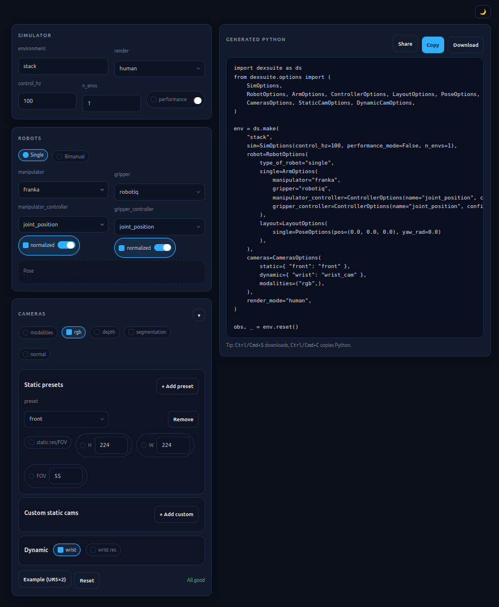
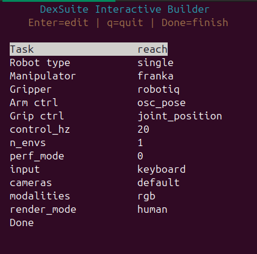

Environment Builders
====================

DexSuite exposes a large configuration space: task, robot, controllers, layout,
cameras, and sensor modalities. This section introduces you to three ways to produce a valid
``ds.make(...)`` call quickly.

.. list-table::
   :widths: 25 75
   :header-rows: 1

   * - Builder
     - Best For
  * - Manual Build
     - Integration with other projects, ultimate control and customization.
   * - Web Builder
     - Instant code generation in a browser, no terminal needed.
   * - Interactive Builder
     - Guided terminal setup with a reusable JSON spec and optional live runner.

Manual Build
------------

The frist way to create your setup is to fill the ``ds.make(...)`` function manually.
.. code-block:: python

   env = ds.make(
       task,
       manipulator="ur5",
       gripper="allegro",
       arm_control="osc_pose_abs_quat",
       gripper_control="joint_position",
       sim=ds.SimOptions(control_hz=20),
       cameras=["front", "wrist"],
       render_mode="human",
   )
We will go more in detail with the API in :doc:`../core_concepts/api_overview`.
Setting every parameter by hand can be time consuming, therefore we introduce two ways to simplify environment building.

Web-Based Builder
-----------------

The Web builder is a single, self-contained file that runs entirely in the browser. You can access it in one of two ways:

Option 1: Run a Local Server
^^^^^^^^^^^^^^^^^^^^^^^^^^^^

You can serve the file locally using Python's built-in HTTP server. Run this command from your terminal:

.. code-block:: bash

   python3 -m http.server -d scripts/interactive_builder/

Once the server is running, open your web browser and navigate to ``http://localhost:8000/env_builder.html`` to access the builder.

Option 2: Open the File Directly
^^^^^^^^^^^^^^^^^^^^^^^^^^^^^^^^

Since it requires no backend, you can simply open the HTML file directly from your file manager into any browser. Locate the following file:

.. code-block:: text 

   scripts/interactive_builder/env_builder.html

Double-click the file to open it. Configure your environment using the dropdown menus, and copy the generated ``ds.make(...)`` snippet into your script or notebook.

What It Generates
~~~~~~~~~~~~~~~~~

.. list-table::
   :widths: 30 70
   :header-rows: 1

   * - Parameter
     - Description
   * - Task key
     - The string identifier passed to ``ds.make()``.
   * - Robot configuration
     - Single-arm or bimanual, manipulator model, and gripper model.
   * - Controllers
     - Arm controller mode and gripper controller mode.
   * - Layout preset
     - Workspace layout for bimanual configurations.
   * - Cameras and modalities
     - Camera names and observation types (RGB, depth, segmentation).
   * - Workspace AABB
     - Axis-aligned bounding box for the selected manipulator, displayed as a reference.

Interactive Builder
-------------------

The interactive builder provides a guided terminal interface and produces a reusable
JSON configuration file. It can also launch a live runner after configuration is complete.

.. code-block:: bash

   python -m dexsuite.interactive_builder

By default, the builder:

- Launches a full terminal UI (TUI). If ``curses`` is unavailable, it falls back to a simpler prompt-based UI.
- Writes the completed configuration to ``dexsuite_builder_spec.json``.
- Offers to run the environment immediately using the chosen input device.

Common Workflows
~~~~~~~~~~~~~~~~

Generate a spec file without launching the environment:

.. code-block:: bash

   python -m dexsuite.interactive_builder --no-run --output dexsuite_builder_spec.json

Run an environment from an existing spec file:

.. code-block:: bash

   python -m dexsuite.interactive_builder run \
     --config dexsuite_builder_spec.json \
     --input keyboard

Select a UI mode explicitly:

.. code-block:: bash

   # Full terminal UI
   python -m dexsuite.interactive_builder --ui tui

   # Simple prompt UI (for environments without curses support)
   python -m dexsuite.interactive_builder --ui simple

Supported Input Devices for the Runner
~~~~~~~~~~~~~~~~~~~~~~~~~~~~~~~~~~~~~~~

Next Steps
----------

- :doc:`../core_concepts/api_overview` covers the full ``ds.make()`` API and all available parameters.
- :doc:`../core_concepts/cameras_sensors` explains how to configure cameras and sensor modalities.
