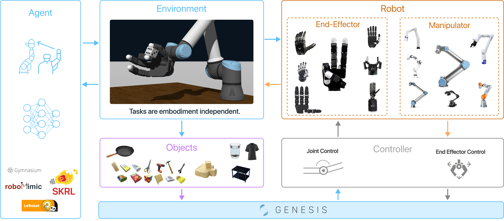

.. _api_overview:

API Overview
============

This page explains the public DexSuite surface:

- How to create an environment with :func:`dexsuite.make`
- What ``reset()`` and ``step()`` return
- How actions and observations are structured
- The two configuration styles (flat vs component options)
- Tools that help you generate configs (HTML builder and interactive builder)

Quickstart (flat API)
---------------------

.. code-block:: python

   import dexsuite as ds

   env = ds.make(
       "lift",
       manipulator="franka",
       gripper="robotiq",
       arm_control="osc_pose",
       gripper_control="joint_position",
       render_mode="human",
   )

   obs, info = env.reset()
   obs, reward, terminated, truncated, info = env.step(env.action_space.sample())
   env.close()

Reset and step returns
----------------------

DexSuite follows the Gymnasium API shape:

- ``reset() -> (obs, info)``
- ``step(action) -> (obs, reward, terminated, truncated, info)``

``terminated`` and ``truncated`` are boolean tensors of shape ``(n_envs,)``.
For a single environment (``n_envs=1``), treat them as 1-element tensors.

Info dict
~~~~~~~~~

DexSuite adds a few standard fields to ``info``:

- ``info["success"]``: per-env success mask
- ``info["failure"]``: per-env failure mask
- ``info["needs_reset"]``: per-env mask, true when an episode ended (success, failure, or horizon)

Actions
-------

DexSuite uses a single, flat action vector.

- Single env: shape ``(D,)``
- Batched envs: shape ``(n_envs, D)``

``D`` depends on the robot and controller choices. Inspect it with
``env.action_space.shape``.

What you can pass to ``env.step``
~~~~~~~~~~~~~~~~~~~~~~~~~~~~~~~~~

``env.step(action)`` accepts:

- a torch tensor
- a NumPy array
- a Python sequence (list/tuple)

DexSuite converts the input to ``torch.float32`` on the environment device. For
batched environments, you can pass a single ``(D,)`` action and it will be
broadcast to ``(n_envs, D)``.

Observations
------------

Observations are a dictionary with two top-level keys:

- ``obs["state"]``: robot state plus task state (torch tensors)
- ``obs["cameras"]``: camera outputs (if cameras are enabled)

Single-arm structure
~~~~~~~~~~~~~~~~~~~~

In single-arm environments, robot state is under:

- ``obs["state"]["manipulator"]``
- ``obs["state"]["gripper"]``

Common fields include:

- ``obs["state"]["gripper"]["tcp_pos"]``: tool center point position

Bimanual structure
~~~~~~~~~~~~~~~~~~

In bimanual environments, robot state is split by side:

- ``obs["state"]["left"]["gripper"]["tcp_pos"]``
- ``obs["state"]["right"]["gripper"]["tcp_pos"]``

Task-specific fields
~~~~~~~~~~~~~~~~~~~~

Tasks can add extra tensors under ``obs["state"]["other"]`` by returning them
from ``_get_extra_obs``. DexSuite also stores:

- ``obs["state"]["other"]["action"]``
- ``obs["state"]["other"]["last_action"]``

Two ways to configure ``ds.make``
---------------------------------

DexSuite supports two configuration styles. Both end up building the same
objects internally.

For a deeper explanation of every option block (sim, robot, layout, cameras),
see :doc:`configuration_system`.

1) Flat API (easiest)
~~~~~~~~~~~~~~~~~~~~~

This is the short form. You specify robot/controller choices with strings.

.. code-block:: python

   import dexsuite as ds

   env = ds.make(
       "reach",
       manipulator="franka",
       gripper="robotiq",
       arm_control="osc_pose",
       gripper_control="joint_position",
       control_hz=20,
       n_envs=1,
       cameras=("front", "wrist"),
       modalities=("rgb",),
       render_mode="human",
   )

For bimanual tasks, pass two manipulators and (optionally) a layout preset:

.. code-block:: python

   import dexsuite as ds

   env = ds.make(
       "bimanual_reach",
       manipulator=("franka", "franka"),
       gripper="robotiq",
       arm_control="osc_pose",
       gripper_control="joint_position",
       layout="side_by_side",
       render_mode="human",
   )

2) Component API (most control)
~~~~~~~~~~~~~~~~~~~~~~~~~~~~~~~

This is the explicit form. You pass dataclasses that describe the robot, sim,
and cameras.

.. code-block:: python

   import dexsuite as ds
   from dexsuite.options import CamerasOptions, RobotOptions, SimOptions

   env = ds.make(
       "lift",
       robot=RobotOptions(type_of_robot="single"),
       sim=SimOptions(control_hz=50, n_envs=8, performance_mode=True),
       cameras=CamerasOptions(modalities=("rgb",)),
       render_mode=None,
   )

Use the component API when you need to:

- Override workspace AABBs
- Set explicit base poses for robots
- Use custom camera definitions
- Keep a fully reproducible configuration in one object

Workspaces and layout
---------------------

Workspaces are defined per manipulator in ``Dexsuite/dexsuite/config/workspaces.yaml``.
Those AABBs are transformed into the world frame using layout poses.

See :doc:`Workspace Layout <workspace_layout>` for details and examples.

Tools that help you build configs
---------------------------------

HTML environment builder
~~~~~~~~~~~~~~~~~~~~~~~~

DexSuite includes a small, self-contained HTML tool:

- ``Dexsuite/env_builder.html``

Open it in a browser and it will generate ``ds.make(...)`` code for common
combinations (task, robot, controllers, cameras, layout). It also shows the
workspace AABB that corresponds to the selected manipulator.

Interactive builder (TUI/CLI)
~~~~~~~~~~~~~~~~~~~~~~~~~~~~~

DexSuite also ships an interactive builder that runs in your terminal and can
save a reusable spec to JSON.

Run it:

.. code-block:: bash

   python -m dexsuite.interactive_builder

It writes a JSON spec (default: ``dexsuite_builder_spec.json``). You can run
again from an existing spec:

.. code-block:: bash

   python -m dexsuite.interactive_builder run --config dexsuite_builder_spec.json --input keyboard

.. _api_overview_teleop:

Teleoperation
-------------

DexSuite supports several input devices (keyboard, spacemouse, VR devices). The
interactive builder can launch a small runner that reads a device and steps the
environment.

See:

- ``Dexsuite/dexsuite/interactive_builder/runner.py`` for the teleop loop
- ``Dexsuite/dexsuite/devices/`` for device implementations
