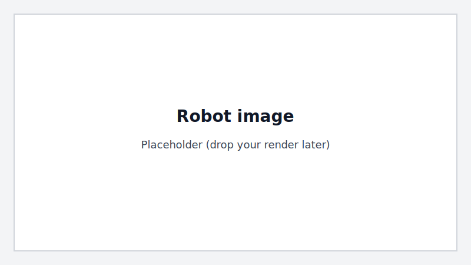

Models
====================
In DexSuite documentation, **models** are simulation assets: robot descriptions,
objects, textures, and the arena. This is not about machine learning models.

Assets live under ``Dexsuite/dexsuite/models/`` and are loaded into a Genesis
scene using morphs such as ``gs.morphs.MJCF``, ``gs.morphs.URDF``, and
``gs.morphs.Mesh``.

Asset path helpers
------------------

DexSuite provides two helpers that tasks use to stay independent of the current
working directory:

- ``dexsuite.utils.get_object_path(name, prefer=None)``
- ``dexsuite.utils.get_texture_paths(name)``

Example
~~~~~~~

.. code-block:: python

   import genesis as gs
   from dexsuite.utils import get_object_path

   mug = get_object_path("kitchen/mug")  # resolves to a file under models/objects

   ent = scene.add_entity(
       morph=gs.morphs.MJCF(file=str(mug)),
       material=gs.materials.Rigid(),
   )

Environment variable overrides
~~~~~~~~~~~~~~~~~~~~~~~~~~~~~~

If you want to point DexSuite to a different asset repository, you can override
the model roots with environment variables:

- ``DEXSUITE_OBJECTS_DIR``
- ``DEXSUITE_TEXTURES_DIR``

Arena
-----

Every environment includes an arena built from a YAML spec:

- Default spec: ``Dexsuite/dexsuite/models/arena/arena.yaml``
- Builder: ``Dexsuite/dexsuite/models/arena/arena.py``

The arena can include:

- A ground plane.
- Optional wall panels.
- An optional table loaded from MJCF.

The arena builder also handles MJCF ``<include ...>`` files so that complex
tables can be loaded reliably.

Robots
------

A robot is composed of:

- A **manipulator** (arm)
- An optional **gripper** (hand)

Robot assets live under:

- ``Dexsuite/dexsuite/models/manipulators/``
- ``Dexsuite/dexsuite/models/grippers/``

DexSuite registers manipulators and grippers by string keys, so environment
creation can stay short and readable. See :doc:`Robots <robots>` for how robot
options and layouts work.

Objects
-------

Task objects live under ``Dexsuite/dexsuite/models/objects/``. Objects are
organized by category (for example ``kitchen/`` and ``tools/``) and can contain
multiple file types. ``get_object_path`` picks a file using a sensible extension
priority (MJCF, URDF, then meshes), or you can request a preference:

- ``prefer="mjcf"``
- ``prefer="urdf"``
- ``prefer="mesh"``
- or a specific extension like ``prefer="obj"``

Textures
--------

Textures live under ``Dexsuite/dexsuite/models/textures/``. A texture name maps
to a directory, and the files inside that directory are returned as a dict of
component paths (diffuse, normal, roughness, etc.) by ``get_texture_paths``.
